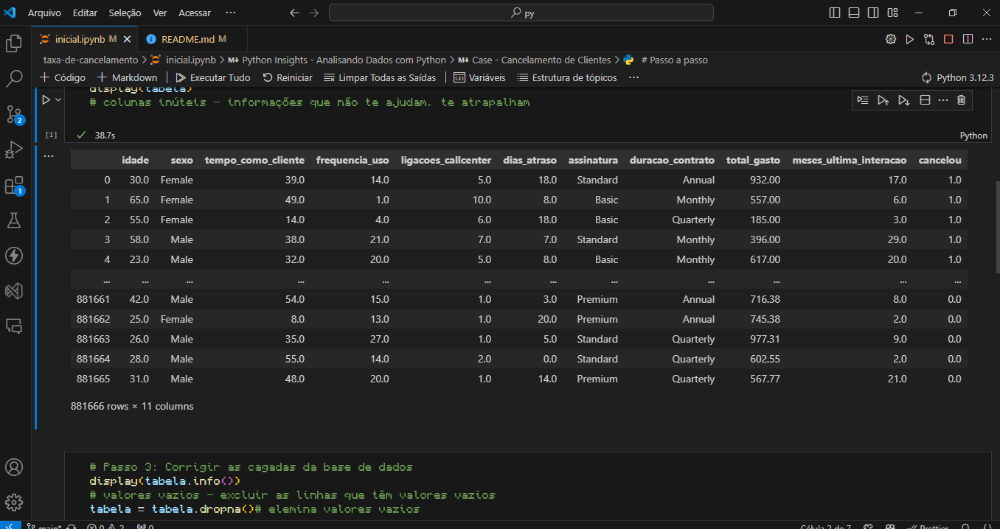
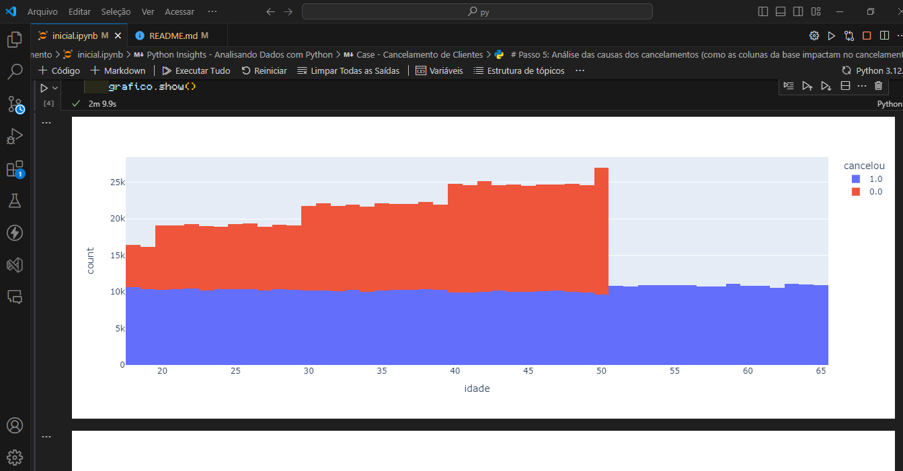
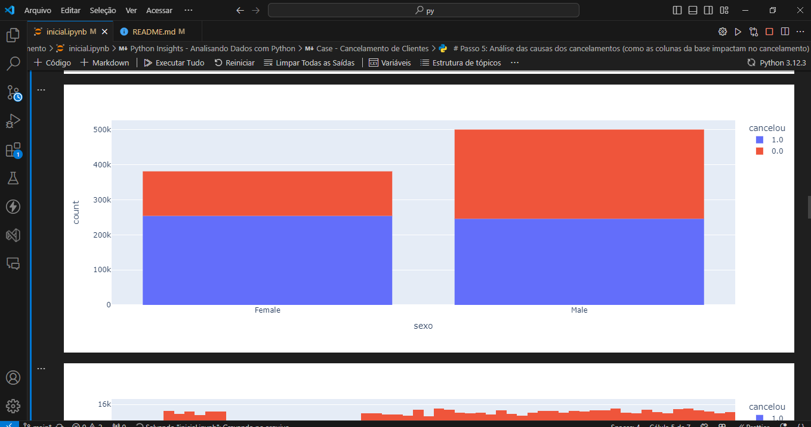

# Projeto 2: Análise de Banco de Dados com Gráficos

## Descrição
Este projeto envolve a criação de um código em Python e Jupyter que analisa um banco de dados e expressa a relação entre os clientes e as taxas de cancelamento através de gráficos. O objetivo é visualizar padrões e tendências nos dados de forma clara e intuitiva.

## Funcionalidades
- Carregamento e limpeza de dados.
- Análise estatística dos dados.
- Criação de gráficos interativos para visualização das relações entre variáveis.
- Identificação de padrões de cancelamento de clientes.

## Tecnologias Utilizadas
- Python
- Pandas
- Matplotlib / Seaborn
- Jupyter Notebook

## Imagem do Projeto

## Conclusão
Este projeto permite uma melhor compreensão dos fatores que influenciam o cancelamento de clientes, auxiliando na tomada de decisões estratégicas para retenção de clientes.
